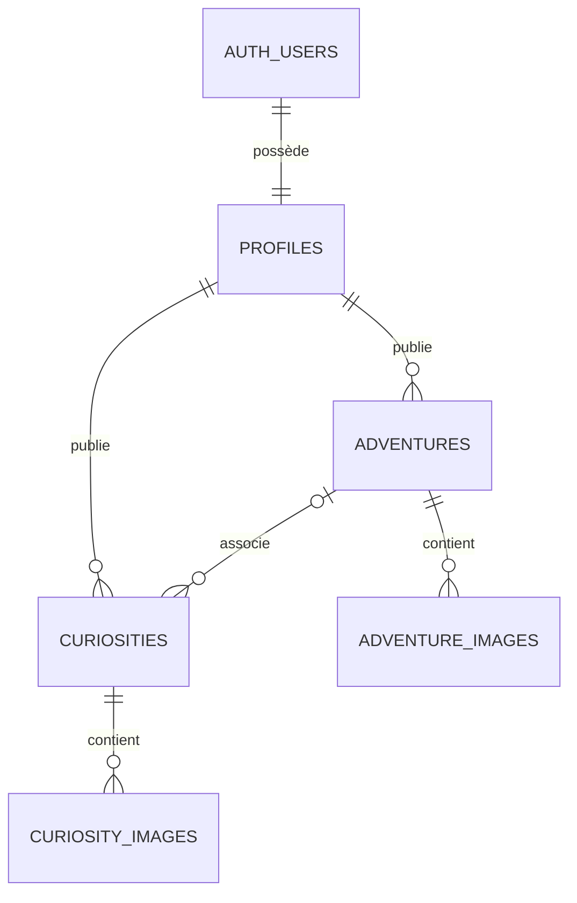

# Modèle de données Fragmenta

**État documenté :** 20 juillet 2026  
**Source :** audit du schéma Supabase de production

## Vue d'ensemble



Les identifiants principaux utilisent le type UUID. Les suppressions d'un compte entraînent la suppression en cascade de son profil et de son contenu propriétaire selon les clés étrangères existantes.

## `profiles`

Profil applicatif associé à `auth.users` par une relation un-à-un.

| Colonne | Type | Utilisation |
|---|---|---|
| `id` | UUID | Identifiant du compte et clé primaire |
| `username` | texte | Nom d'utilisateur unique |
| `display_name` | texte | Nom public |
| `bio` | texte | Présentation publique |
| `avatar_url` | texte | URL de l'avatar |
| `social_links` | JSON | Liste flexible de réseaux sociaux et liens externes |
| `country` | texte | Pays facultatif |
| `created_at` | horodatage | Date de création |
| `updated_at` | horodatage | Dernière modification |
| `identity_status` | texte | État interne de vérification |
| `identity_verified_at` | horodatage | Date interne de vérification |
| `premium_status` | texte | État interne de l'abonnement |
| `stripe_verification_session_id` | texte | Référence interne Stripe |

Valeurs permises pour `identity_status` :

- `unverified`
- `pending`
- `verified`
- `failed`
- `requires_input`

Valeurs permises pour `premium_status` :

- `free`
- `premium_pending`
- `premium`

Les champs d'identité, de paiement et de vérification ne sont ni lisibles ni modifiables directement par le client. Les utilisateurs peuvent uniquement modifier les champs publics de leur propre profil.

## `adventures`

Projet de voyage ou défi appartenant à un utilisateur.

| Colonne | Type | Utilisation |
|---|---|---|
| `id` | UUID | Clé primaire |
| `owner_id` | UUID | Propriétaire, référence `profiles.id` |
| `title` | texte | Titre |
| `description` | texte | Description |
| `category` | texte | Type d'aventure |
| `start_location` | texte | Point de départ facultatif |
| `destination` | texte | Destination facultative |
| `status` | texte | État de progression |
| `publication_status` | texte | État de publication (`draft` ou `published`) |
| `visibility` | texte | Niveau de visibilité |
| `day_label` | texte | Libellé chronologique actuel |
| `distance_km` | nombre | Distance connue |
| `detail` | texte | Détail complémentaire |
| `latitude` | nombre | Latitude facultative |
| `longitude` | nombre | Longitude facultative |
| `created_at` | horodatage | Date de création |
| `updated_at` | horodatage | Dernière modification |

Valeurs permises pour `status` :

- `preparation`
- `active`
- `completed`

Le propriétaire choisit ce statut depuis l’écran de modification de son aventure.

Valeurs permises pour `publication_status` :

- `draft`
- `published`

Valeurs permises pour `visibility` :

- `public`
- `followers`
- `private`

Une aventure est lisible si elle est publique ou si l'utilisateur connecté en est propriétaire. La visibilité `followers` nécessitera une nouvelle politique lorsque le système d'abonnements sera développé.

## `adventure_images`

Images ordonnées d'une aventure.

| Colonne | Type | Utilisation |
|---|---|---|
| `id` | UUID | Clé primaire |
| `adventure_id` | UUID | Référence `adventures.id` |
| `owner_id` | UUID | Référence `profiles.id` |
| `image_url` | texte | URL publique |
| `storage_path` | texte | Chemin interne du fichier |
| `position` | entier | Ordre d'affichage |
| `created_at` | horodatage | Date de création |

Le chemin suit la convention :

```text
<user-id>/<adventure-id>/<fichier>
```

La politique RLS vérifie que l'image, son chemin et l'aventure appartiennent au même utilisateur.

## `fragments`

Étape chronologique documentant la progression d'une aventure.

| Colonne | Type | Utilisation |
|---|---|---|
| `id` | UUID | Clé primaire |
| `adventure_id` | UUID | Aventure parente |
| `owner_id` | UUID | Propriétaire de l'aventure |
| `title` | texte | Titre de l'étape |
| `body` | texte | Récit ou note |
| `occurred_at` | horodatage | Date réelle du fragment |
| `latitude` | nombre | Latitude facultative |
| `longitude` | nombre | Longitude facultative |
| `position` | entier | Ordre dans la chronologie |
| `status` | texte | `draft` ou `published` |
| `created_at` | horodatage | Date de création |
| `updated_at` | horodatage | Dernière modification |

Un fragment appartient obligatoirement à une aventure du même propriétaire. Un brouillon est visible uniquement par son propriétaire. Un fragment publié est public seulement lorsque son aventure est elle-même publiée et publique.

## `fragment_images`

Photos ordonnées d'un fragment. Le chemin Storage suit le format `utilisateur/fragment/fichier` dans le bucket `fragment-images`. La limite est de 10 Mo par image, aux formats JPEG, PNG, WebP ou HEIC.

| Colonne | Type | Utilisation |
|---|---|---|
| `id` | UUID | Clé primaire |
| `fragment_id` | UUID | Fragment parent |
| `owner_id` | UUID | Propriétaire |
| `image_url` | texte | URL publique |
| `storage_path` | texte | Chemin interne sécurisé |
| `position` | entier | Ordre d'affichage |
| `created_at` | horodatage | Date de création |

## `curiosities`

Lieu remarquable documenté par la communauté.

| Colonne | Type | Utilisation |
|---|---|---|
| `id` | UUID | Clé primaire |
| `owner_id` | UUID | Propriétaire, référence `auth.users.id` |
| `adventure_id` | UUID | Aventure facultative |
| `title` | texte | Titre |
| `description` | texte | Description |
| `category` | texte | Catégorie |
| `location_name` | texte | Nom du lieu |
| `address` | texte | Adresse |
| `latitude` | nombre | Latitude facultative |
| `longitude` | nombre | Longitude facultative |
| `accessibility` | texte | Information d'accès |
| `best_time_to_visit` | texte | Meilleur moment |
| `recommended_duration` | texte | Durée conseillée |
| `status` | texte | État de publication |
| `verification_status` | texte | État de vérification |
| `created_at` | horodatage | Date de création |
| `updated_at` | horodatage | Dernière modification |

Valeurs permises pour `status` :

- `draft`
- `pending`
- `published`
- `needs_update`
- `closed`

Valeurs permises pour `verification_status` :

- `unverified`
- `community_confirmed`
- `verified`

Le propriétaire contrôle le contenu et le statut de publication, mais pas le statut de vérification. Une curiosité peut être indépendante ou rattachée uniquement à une aventure du même propriétaire.

## `curiosity_images`

Images ordonnées d'une curiosité.

| Colonne | Type | Utilisation |
|---|---|---|
| `id` | UUID | Clé primaire |
| `curiosity_id` | UUID | Référence `curiosities.id` |
| `image_url` | texte | URL publique |
| `position` | entier | Ordre d'affichage |
| `created_at` | horodatage | Date de création |

La propriété est déterminée par la curiosité parente. Les images sont lisibles lorsque la curiosité est publiée ou appartient à l'utilisateur connecté.

## Favoris

La table `favorites` conserve la collection privée d'un utilisateur.

| Colonne | Type | Utilisation |
|---|---|---|
| `id` | UUID | Clé primaire |
| `owner_id` | UUID | Propriétaire du favori |
| `adventure_id` | UUID | Aventure enregistrée, facultative |
| `curiosity_id` | UUID | Curiosité enregistrée, facultative |
| `created_at` | horodatage | Date d'ajout |

Un favori référence exactement une aventure ou une curiosité. Les doublons sont interdits et les politiques RLS permettent uniquement au propriétaire de lire, créer ou retirer ses favoris.

## Signalements

La table `reports` reçoit les signalements d'aventures, de curiosités ou de profils. Chaque ligne possède exactement une cible, un motif, des détails facultatifs et un état de traitement. Un utilisateur peut consulter ses propres signalements, mais ne peut ni les modifier ni accéder à ceux des autres. Le traitement administratif utilisera ultérieurement un accès serveur privilégié et journalisé.

## Buckets Storage

| Bucket | Public | Limite | Types autorisés |
|---|---:|---:|---|
| `adventure-images` | Oui | 10 Mo | JPEG, PNG, WebP, HEIC |
| `curiosity-images` | Oui | 10 Mo | JPEG, PNG, WebP, HEIC |
| `fragment-images` | Oui | 10 Mo | JPEG, PNG, WebP, HEIC |
| `avatars` | Oui | 5 Mo | JPEG, PNG |

Les écritures sont limitées à un dossier dont le premier segment correspond à l'identifiant de l'utilisateur connecté.

## Index applicatifs

- aventures par propriétaire;
- aventures par date décroissante;
- images d'aventure par aventure et position;
- curiosités par propriétaire;
- curiosités par statut et date décroissante;
- images de curiosité par curiosité et position.

## Évolutions prévues

Le modèle devra être étendu pour ajouter :

- les abonnements;
- les favoris;
- les signalements;
- les rôles de modération;
- l'historique des validations;
- les notifications.

Chaque évolution doit être ajoutée sous forme de migration, accompagnée de politiques RLS et d'assertions de sécurité.
